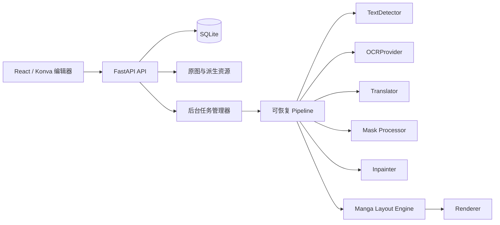

# MangaFlow

[](https://github.com/ALittlePandaMan/MangaFlow/actions/workflows/ci.yml)

MangaFlow 是一个面向日本漫画的非破坏式 AI 翻译与嵌字工作台。它把文字检测、OCR、上下文翻译、文字分割、背景修复、横/竖排版、人工精修和批量导出串成可恢复流水线。原图始终只读，Mask、净图、透明文字层和最终译图分别保存。

当前仓库提供完整可运行的本地工作流。Docker 镜像已安装 PaddleOCR/PaddlePaddle 与 MangaOCR，默认使用 PaddleOCR 检测、MangaOCR 识别日文漫画。首次执行缺少配置的阶段时会自动创建推荐默认配置并下载所需权重。翻译在未配置 LLM 时只透传原文并标记复核，不会伪装成翻译结果。

> 当前版本定位为可信本机或受控局域网工具，没有用户登录和公网级权限隔离。请勿直接暴露到互联网，详见 [安全策略](SECURITY.md)。

[架构](docs/architecture.md) · [配置与迁移](docs/configuration.md) · [开发指南](docs/development.md) · [常见问题](docs/troubleshooting.md) · [参与贡献](CONTRIBUTING.md)

## 架构



后端业务只依赖抽象接口，模型选择集中在 `ProviderRegistry`。开发队列使用 `asyncio` 后台任务，包含队列、暂停、继续、失败重试、取消、进度和 WebSocket 更新；`ProcessingTask` 与 Pipeline 边界可直接替换为 Celery、RQ 或 Dramatiq worker，业务阶段无需改写。

## 已实现功能

- Project、批量图片上传、页序、缩略图导航和非破坏式文件存储。
- 稳定 `TextRegion` ID 与 `R001` 区域键；polygon、bbox、OCR、翻译、样式、Mask、锁定、复核原因和版面结果贯穿所有阶段。
- 页级和区域级 Detection / OCR / Translation / Inpainting / Rendering API；Pipeline 可从任意阶段继续。
- OpenCV 文本候选检测、可选 PaddleOCR polygon 检测、旋转/多边形区域、日漫右到左阅读顺序，以及 MangaOCR/PaddleOCR/Tesseract OCR 适配器；检测行默认保持独立，不强制合并成超出气泡的大框。
- OpenAI-compatible 严格 JSON 翻译，支持 Ollama、vLLM、LM Studio 等兼容端点；检查 ID 遗漏/新增，自动重试。
- Polygon Mask、画笔/橡皮擦、硬度、撤销/重做、Clear/Dilate/Erode/Blur/Expand。
- 文本分割 Mask 只修改文字像素附近；背景修复统一交给 LaMa，并始终从不可变原图重建，避免整图色偏和重复处理污染。
- 漫画排版引擎：字形测量、逐字符换行、字号拟合、最小字号和 overflow；中文竖排按右到左列逐字布局，不旋转整段文字，并处理竖排标点和西文旋转。
- TrueType/OpenType、项目字体上传、按字符字体 fallback、颜色、描边、行距、字距、对齐、旋转与透明度。
- React/Konva 分层画布：缩放、平移、适屏、多选、拖动、四边形/多边形顶点、旋转、矩形/多边形/套索建区和区域合并。
- Original / Clean / Translated / Comparison 视图，五类独立图层，原文框与译文框独立几何，当前编辑会话 Undo/Redo。
- 最终译图、净图和可二次编辑的完整工程导出；未修复页面导出净图时自动回退原图。
- 云端 API Key 只写入被忽略的 `.env`，列表和响应只返回 `has_api_key`，日志不输出密钥。

## 目录

```text
.github/                    CI、Dependabot 和协作模板
backend/app/api/            FastAPI 路由
backend/app/application/    跨路由应用命令
backend/app/services/       Provider 与领域服务
backend/tests/              核心算法与 API 测试
frontend/src/components/    共享 UI
frontend/src/features/      编辑器等业务模块
frontend/src/pages/         路由页面
config.example.yaml         可公开提交的脱敏配置模板
config.yaml                 当前六项生效配置（不提交）
data/                       原图及派生资源（不提交）
models/                     本地模型缓存（不提交）
docker/                     后端、前端与 Nginx 镜像
docs/                       架构、配置与开发文档
scripts/                    初始化、开发和检查脚本
```

## 环境要求

- Python 3.11 或 3.12
- Node.js 20+
- 推荐安装 Noto Sans CJK 字体；Docker 镜像已包含
- OpenCV fallback 仅需 CPU。MangaOCR 或其他深度模型可使用 CUDA；具体 CUDA/PyTorch 版本应与显卡驱动匹配安装
- Docker 24+ 与 NVIDIA Container Toolkit（Docker GPU 推理）

## 本地安装与启动

```bash
./scripts/bootstrap.sh
./scripts/dev.sh
```

打开 `http://localhost:5173`；API 文档位于 `http://localhost:8000/docs`。也可以分别运行：

```bash
cd backend && ../.venv/bin/uvicorn app.main:app --reload --port 8000
cd frontend && npm run dev
```

## Docker

```bash
./scripts/docker.sh up --build
```

该脚本在 WSL + Docker Desktop 环境中会自动调用 Windows Docker 客户端，确保 `data` 和 `models` 真正挂载到项目目录；在原生 Linux/macOS 中则直接调用 `docker compose`。后续的 Compose 命令也建议通过该脚本执行，例如 `./scripts/docker.sh ps`。

打开 `http://localhost:8080`。`data/` 与 `models/` 以卷挂载，因此重建容器不会丢失工程或已下载的权重；`config.yaml` 与 `.env` 会挂载到容器并在设置保存时同步更新。首次启动缺少本地配置时，`scripts/docker.sh` 会从脱敏的 `config.example.yaml` 与 `.env.example` 自动创建。

## 模型配置

当前可迁移配置位于 `config.yaml`，里面保存文字检测、图像修复、OCR、排版、云端翻译与字体六项活动配置，不包含数据库 ID、运行数据或任何 API Key。在设置页面安装、切换或编辑 Provider 后，后端会自动把当前生效配置原子写回该文件。Docker 后端每次启动都会幂等读取它：已有网页配置保持不变，只补齐缺失阶段；配置中启用 `preload` 后，会自动下载并加载缺失的 PaddleOCR、MangaOCR 和 LaMa 权重。

云端翻译的地址、协议、模型和 Prompt 会写入 `config.yaml`，密钥只写入被 Git 忽略的 `.env`，不会进入 YAML 或 API 响应。`config.example.yaml` 和 `.env.example` 只包含 `example.com`、`example-model` 与空密钥。迁移到另一台电脑时，安全复制源码、`config.yaml`、`.env` 与需要保留的 `data/`，然后执行：

```bash
./scripts/docker.sh up --build -d
```

`models/` 为空时会自动重新下载，复制原有 `models/` 则可直接复用缓存。Compose 健康检查会让前端等待后端完成首次模型准备，避免下载期间过早进入工作台。

首次运行某阶段且没有默认配置时，后端仍会自动登记推荐配置。也可以在“设置”页面点击“安装推荐配置”，一次完成配置升级、权重下载和加载验证；CLI 等价命令为：

```bash
./scripts/docker.sh exec backend python -m app.services.model_provisioning --preload --upgrade-fallbacks
```

推荐组合与可替换 Provider：

- Detection：内置 `opencv-fallback`，或可选 `paddleocr` polygon 检测；`group_text_lines` 默认关闭，避免区域合并后超出气泡。
- OCR：默认 `manga-ocr`；也可选择 `review-fallback`、`tesseract` 或 `paddleocr`。首次加载 MangaOCR 会下载约 400 MB 权重。
- Translation：`openai-compatible`。填写 Base URL、模型名和 API Key；Ollama 示例地址为 `http://localhost:11434/v1`。
- Inpainting：Docker 镜像内置 `simple-lama-inpainting`，推荐配置统一使用 `lama` 处理文字区域；`opencv` 仅作为低资源备选。
- Rendering：`pillow`，支持系统 `.ttf` / `.otf` / `.ttc` / `.otc` 字体集合和项目上传字体；低对比文字会自动补反色描边。

Docker 默认把 NVIDIA GPU 注入后端，并使用 CUDA 12.6 版 PyTorch/PaddlePaddle。可迁移清单的 `device: recommended` 只在缺失配置首次导入时检测硬件，并在数据库中落成明确的 `cuda:0` 或 `cpu`，Provider 运行期间不使用 `auto`。可用 `.env` 中的 `MANGAFLOW_GPU_DEVICE` 指定 GPU index/UUID，默认为 `all`。

非 Docker 开发环境如只需 CPU，可先安装 PyTorch CPU 版，再安装模型依赖：

```bash
pip install --index-url https://download.pytorch.org/whl/cpu torch==2.6.0
pip install --extra-index-url https://www.paddlepaddle.org.cn/packages/stable/cpu/ -r backend/requirements/models.txt
```

Paddle Provider 会自动将保存的 `cuda:0` 转换为 Paddle 使用的 `gpu:0`。

## 环境变量

所有变量以 `MANGAFLOW_` 开头。常用变量见 `.env.example`：数据目录、模型目录、模型清单路径、云端翻译 API Key、自动配置开关、数据库 URL、CORS、上传大小、OCR 复核阈值、队列并发数与 Fernet 密钥。不要把真实 `.env` 或密钥提交到版本库。

## 完整操作流程

1. 新建项目并批量导入漫画原图。
2. 打开编辑器，先检查检测区域，再按 OCR → 翻译 → 修复 → 排版顺序执行；未完成前置阶段时后续按钮不可用。
3. 检查检测框；可拖动/缩放/旋转，编辑 polygon 顶点，或用矩形、多边形、套索补建区域。
4. 在右侧编辑 OCR 原文、方向和几何；右键单一区域可重新 OCR、翻译、修复或排版。
5. 配置 OpenAI-compatible Provider 后按页翻译；锁定人工确认区域可避免批处理覆盖。
6. 切换 Mask Paint，用画笔/橡皮擦修正 Mask，执行膨胀/腐蚀后重新修复。
7. 编辑译文、字体、字号、行字距、颜色、描边、对齐和旋转；重新排版并处理 overflow warning。
8. 导出译图、净图或完整工程 ZIP；工程包可再次导入继续编辑。

## 测试

```bash
./scripts/check.sh
```

测试覆盖日漫阅读顺序、Mask 后处理、结构化翻译 ID、横竖排 font fitting、overflow、项目/页面/区域 API 和密钥脱敏。

## 常见问题

- **找不到中文字形**：安装 Noto Sans CJK，或在项目字体接口/界面上传包含目标字符的 TTF/OTF。
- **MangaOCR 首次很慢**：首次会下载和加载权重；确认缓存目录可写，GPU 环境确认 PyTorch 能识别 CUDA。
- **OpenAI-compatible 返回解析错误**：确认服务支持 chat completions，并让模型只返回以 `R001` 等 ID 为键的 JSON 对象。
- **修复破坏气泡边框**：缩小 Mask 或执行 Erode。Inpainting 是依据上下文生成合理背景，不是恢复已不可见的真实像素。
- **SQLite 锁冲突**：开发环境把并发数保持为 1；多 worker 部署需要另行引入数据库迁移、PostgreSQL 驱动和外部任务队列。
