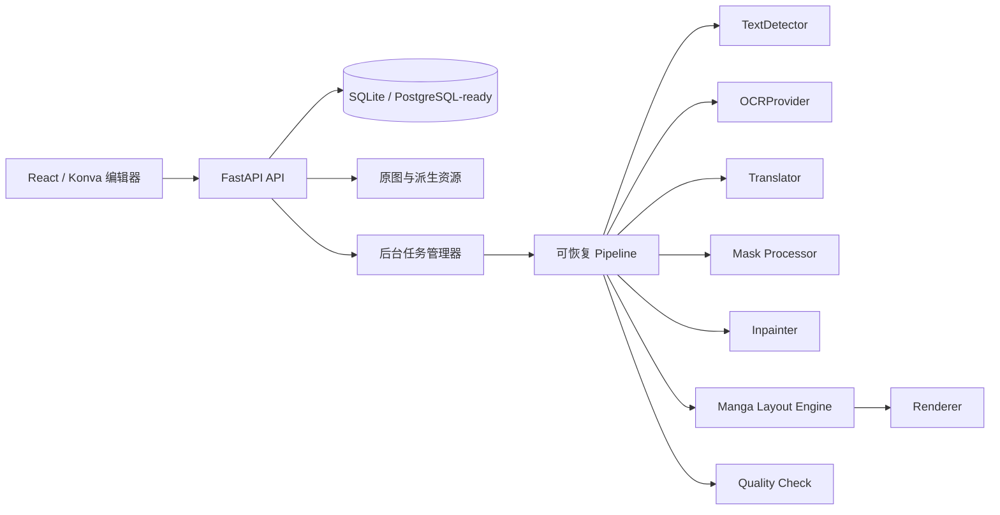

# MangaFlow

MangaFlow 是一个面向日本漫画的非破坏式 AI 翻译与嵌字工作台。它把文字检测、OCR、阅读顺序、上下文翻译、Mask、背景修复、横/竖排版、人工精修、质量检查和批量导出串成一条可恢复流水线；原图始终只读，Mask、净图、透明文字层和最终译图分别保存。

当前仓库提供完整可运行的本地工作流。Docker 镜像已安装 PaddleOCR/PaddlePaddle 与 MangaOCR，默认使用 PaddleOCR 检测、MangaOCR 识别日文漫画。首次执行缺少配置的阶段时会自动创建推荐默认配置并下载所需权重。翻译在未配置 LLM 时只透传原文并标记复核，不会伪装成翻译结果。

## 架构



后端业务只依赖抽象接口，模型选择集中在 `ProviderRegistry`。开发队列使用 `asyncio` 后台任务，包含队列、暂停、继续、失败重试、取消、进度和 WebSocket 更新；`ProcessingTask` 与 Pipeline 边界可直接替换为 Celery、RQ 或 Dramatiq worker，业务阶段无需改写。

## 已实现功能

- Project、批量图片上传、页序、缩略图导航和非破坏式文件存储。
- 稳定 `TextRegion` ID 与 `R001` 区域键；polygon、bbox、OCR、翻译、样式、Mask、锁定、复核原因和版面结果贯穿所有阶段。
- 页级和区域级 Detection / OCR / Translation / Inpainting / Rendering API；Pipeline 可从任意阶段继续。
- OpenCV 文本候选检测、可选 PaddleOCR polygon 检测、同气泡横竖文本行自动聚合、日漫右到左阅读顺序，以及 MangaOCR/PaddleOCR/Tesseract OCR 适配器。
- OpenAI-compatible 严格 JSON 翻译，支持 Ollama、vLLM、LM Studio 等兼容端点；检查 ID 遗漏/新增，自动重试。
- Polygon Mask、画笔/橡皮擦、硬度、撤销/重做、Clear/Dilate/Erode/Blur/Expand。
- `bubble_simple` 使用局部主色填充，复杂艺术字会合并扩展 Mask 并交给 LaMa 深度修复；修复始终从不可变原图重建。
- 漫画排版引擎：字形测量、逐字符换行、字号拟合、最小字号和 overflow；中文竖排按右到左列逐字布局，不旋转整段文字，并处理竖排标点和西文旋转。
- TrueType/OpenType、项目字体上传、按字符字体 fallback、颜色、描边、行距、字距、对齐、旋转与透明度。
- React/Konva 分层画布：缩放、平移、适屏、选择、拖动、缩放、旋转、polygon 顶点、矩形/多边形/套索建区、区域复制/合并/拆分。
- Original / Clean / Translated 视图，五类独立图层，区域属性即时预览，当前编辑会话 Undo/Redo。
- 自动质量检查与 `Needs Review` 页面；最终译图、净图、透明文字层、JSON、Mask、原始工程和 ZIP 导出。
- API Key 使用 Fernet 加密落盘，列表和响应只返回 `has_api_key`，日志不输出密钥。

## 目录

```text
backend/app/       FastAPI、数据库、Provider、Pipeline、任务和存储
backend/tests/     核心算法与 API 测试
frontend/src/      React 页面、Konva 编辑器、状态与 API client
data/projects/     原图及派生资源（不提交）
data/exports/      导出 ZIP（不提交）
models/            可选本地模型权重（不提交）
docker/            后端、前端与 Nginx 镜像
scripts/           本地开发和全量检查脚本
```

## 环境要求

- Python 3.11 或 3.12
- Node.js 20+
- 推荐安装 Noto Sans CJK 字体；Docker 镜像已包含
- OpenCV fallback 仅需 CPU。MangaOCR 或其他深度模型可使用 CUDA；具体 CUDA/PyTorch 版本应与显卡驱动匹配安装
- Docker 24+ 与 NVIDIA Container Toolkit（Docker GPU 推理）

## 本地安装与启动

```bash
python3 -m venv .venv
source .venv/bin/activate
pip install -r backend/requirements/dev.txt

cd frontend
npm install
cd ..

cp .env.example .env
./scripts/dev.sh
```

打开 `http://localhost:5173`；API 文档位于 `http://localhost:8000/docs`。也可以分别运行：

```bash
cd backend && ../.venv/bin/uvicorn app.main:app --reload --port 8000
cd frontend && npm run dev
```

## Docker

```bash
./scripts/docker.sh up --build
```

该脚本在 WSL + Docker Desktop 环境中会自动调用 Windows Docker 客户端，确保 `data` 和 `models` 真正挂载到项目目录；在原生 Linux/macOS 中则直接调用 `docker compose`。后续的 Compose 命令也建议通过该脚本执行，例如 `./scripts/docker.sh ps`。

打开 `http://localhost:8080`。`data/` 与 `models/` 以卷挂载，因此重建容器不会丢失工程或已下载的权重。生产环境应设置固定 `MANGAFLOW_SECRET_KEY`，并把 SQLite URL 改为 PostgreSQL URL；外部 worker 可共享同一数据库和对象存储。

## 模型配置

首次运行某阶段且没有默认配置时，后端会自动登记推荐配置。也可以在“模型”页面点击“安装推荐配置”，一次完成配置升级、权重下载和加载验证；CLI 等价命令为：

```bash
./scripts/docker.sh exec backend python -m app.services.model_provisioning --preload --upgrade-fallbacks
```

推荐组合与可替换 Provider：

- Detection：内置 `opencv-fallback`，或可选 `paddleocr` polygon 检测；默认将统一气泡背景内相邻且同方向的行框聚合成单个 Region，可用 `group_text_lines` 关闭；Comic Text Detector、DBNet 也可通过 `TextDetector` 接口注册。
- OCR：默认 `manga-ocr`；也可选择 `review-fallback`、`tesseract` 或 `paddleocr`。首次加载 MangaOCR 会下载约 400 MB 权重。
- Translation：`openai-compatible`。填写 Base URL、模型名和 API Key；Ollama 示例地址为 `http://localhost:11434/v1`。
- Inpainting：Docker 镜像内置 `simple-lama-inpainting`，首次运行会自动推荐 `hybrid` Provider：简单气泡走 OpenCV 主色填充，复杂背景走 LaMa。纯 `opencv` 和 `lama` 仍可单独选择，ZITS++、MAT 等可继续通过 `Inpainter` 接口注册。
- Rendering：`pillow`，支持系统 `.ttf` / `.otf` / `.ttc` / `.otc` 字体集合和项目上传字体；低对比文字会自动补反色描边。

Docker 默认把 NVIDIA GPU 注入后端，并使用 CUDA 12.6 版 PyTorch/PaddlePaddle。推荐配置的设备值为 `auto`：GPU 可用时优先使用 GPU，CUDA 初始化或推理遇到显存等错误时自动回退 CPU。可用 `.env` 中的 `MANGAFLOW_GPU_DEVICE` 指定 GPU index/UUID，默认为 `all`。

非 Docker 开发环境如只需 CPU，可先安装 PyTorch CPU 版，再安装模型依赖：

```bash
pip install --index-url https://download.pytorch.org/whl/cpu torch==2.6.0
pip install --extra-index-url https://www.paddlepaddle.org.cn/packages/stable/cpu/ -r backend/requirements/models.txt
```

手工添加 Provider 时可填写 `auto`、`cpu` 或 `cuda:0`；Paddle Provider 会自动将 `cuda:0` 转换为 Paddle 使用的 `gpu:0`。

## 环境变量

所有变量以 `MANGAFLOW_` 开头。常用变量见 `.env.example`：数据目录、模型目录、自动配置开关、数据库 URL、CORS、上传大小、OCR 复核阈值、队列并发数与 Fernet 密钥。不要把真实 `.env` 或密钥提交到版本库。

## 完整操作流程

1. 新建项目并批量导入漫画原图。
2. 打开编辑器，点击“处理当前页”或“批量处理”。任务托盘会实时显示阶段与进度。
3. 检查检测框；可拖动/缩放/旋转，编辑 polygon 顶点，或用矩形、多边形、套索补建区域。
4. 在右侧编辑 OCR 原文、方向和区域类型，对单一区域重新 OCR。
5. 配置 OpenAI-compatible Provider 后按页翻译；锁定人工确认区域可避免批处理覆盖。
6. 切换 Mask Paint，用画笔/橡皮擦修正 Mask，执行膨胀/腐蚀后重新修复。
7. 编辑译文、字体、字号、行字距、颜色、描边、对齐和旋转；重新排版并处理 overflow warning。
8. 在 `Needs Review` 中逐项跳转修正低置信度、空文本、缺失 Mask、重叠或越界等问题。
9. 导出译图、净图、透明文字层、OCR/Translation JSON、Mask 和完整工程 ZIP。

## 测试

```bash
./scripts/check.sh
```

测试覆盖日漫阅读顺序、Mask 后处理、结构化翻译 ID、横竖排 font fitting、overflow、项目/页面/区域 API 和密钥脱敏。

## 常见问题

- **页面一直 Needs Review**：离线 OCR/翻译 fallback 会主动产生复核项；安装模型或手工确认文本后再运行质检。
- **找不到中文字形**：安装 Noto Sans CJK，或在项目字体接口/界面上传包含目标字符的 TTF/OTF。
- **MangaOCR 首次很慢**：首次会下载和加载权重；确认缓存目录可写，GPU 环境确认 PyTorch 能识别 CUDA。
- **OpenAI-compatible 返回解析错误**：确认服务支持 chat completions，并让模型只返回以 `R001` 等 ID 为键的 JSON 对象。
- **修复破坏气泡边框**：缩小 Mask 或执行 Erode；简单气泡会优先局部采色，复杂背景才使用 inpaint。Inpainting 是依据上下文生成合理背景，不是恢复已不可见的真实像素。
- **SQLite 锁冲突**：开发环境把并发数保持为 1；生产批量任务请迁移 PostgreSQL 与外部任务队列。
