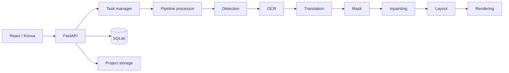

# 架构说明

MangaFlow 是一个本地优先、非破坏式的漫画翻译与嵌字工作台。原图保持只读；检测区域、文字 Mask、净图、透明文字层和最终译图是可重新生成的派生数据。

## 仓库边界

```text
backend/
  app/api/           HTTP/WebSocket 路由与响应边界
  app/application/   跨路由复用的应用命令
  app/pipeline/      可恢复流水线编排
  app/services/      Provider、区域算法、导出与模型配置
  app/storage/       原图和派生文件存储
  app/tasks/         后台任务生命周期
  tests/             后端单元与 API 测试
frontend/
  src/components/    跨业务复用的 UI
  src/features/      单一业务域的组件、hooks 和状态
  src/pages/         路由页面与业务编排
  src/services/      API client
  src/types/         前端领域类型
docker/              镜像与 Nginx 配置
scripts/             初始化、开发、检查和 Docker 命令
```

顶层继续使用 `backend/` 与 `frontend/`，与 FastAPI 官方全栈模板等常见仓库一致。新增业务优先扩展 feature 或 Provider，而不是创建新的顶层应用目录。

## 处理流水线



`ProviderRegistry` 负责把数据库中的生效配置解析为阶段实现。API route 不应直接依赖另一个 route；可复用任务命令位于 `app/application/`。将来替换为 Celery、RQ 或 Dramatiq 时，流水线阶段接口可以保持不变。

## 数据所有权

- SQLite 保存 Project、ImagePage、TextRegion、任务和 Provider 配置元数据。
- `data/projects/` 保存用户原图与派生文件，`data/exports/` 保存导出结果。
- `models/` 保存可重新下载的本地模型缓存。
- `config.yaml` 保存六项生效配置；`.env` 保存密钥和环境覆盖项。

数据库 schema 当前仍由启动兼容逻辑维护。需要复杂迁移或多人协作部署前，应优先引入 Alembic，再拆分 ORM 实体。

## 前端加载策略

项目与设置页面使用轻量共享组件。编辑器及 Konva 画布通过路由级 `React.lazy` 独立加载，因此访问项目首页不会提前下载完整图像编辑器。feature 内部使用直接模块导入，避免大范围 barrel import 破坏分包。

## 结构参考

- [FastAPI Full Stack Template](https://github.com/fastapi/full-stack-fastapi-template)：保留清晰的 `backend/`、`frontend/`、`scripts/` 与 Compose 边界。
- [manga-image-translator](https://github.com/zyddnys/manga-image-translator)：按检测、OCR、修复、翻译和渲染拆分漫画处理能力。
- [GitHub Community Profile](https://docs.github.com/en/communities/setting-up-your-project-for-healthy-contributions/about-community-profiles-for-public-repositories)：组织贡献、安全与协作文件。
